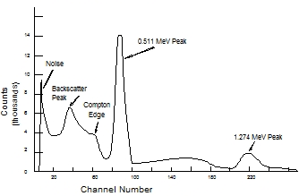
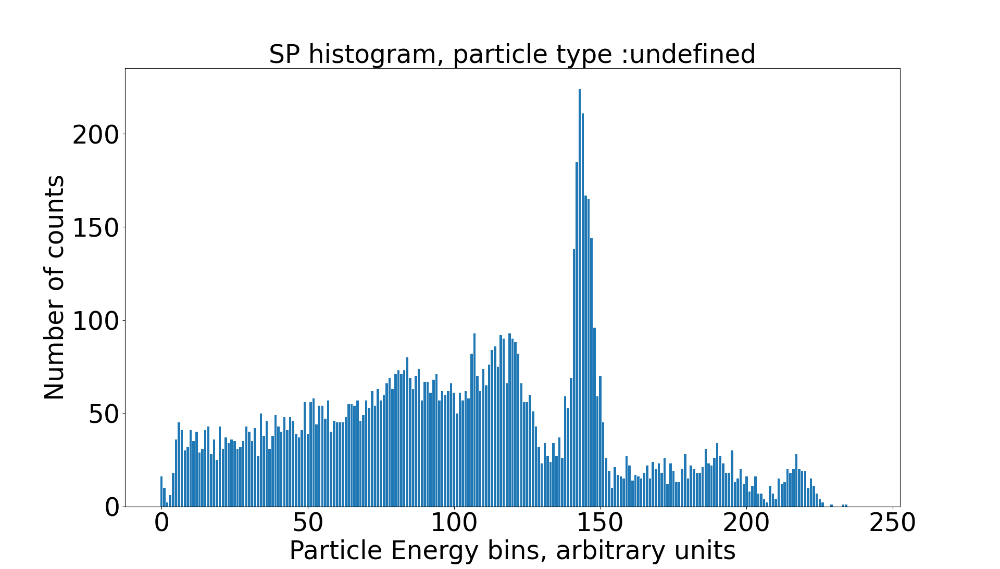
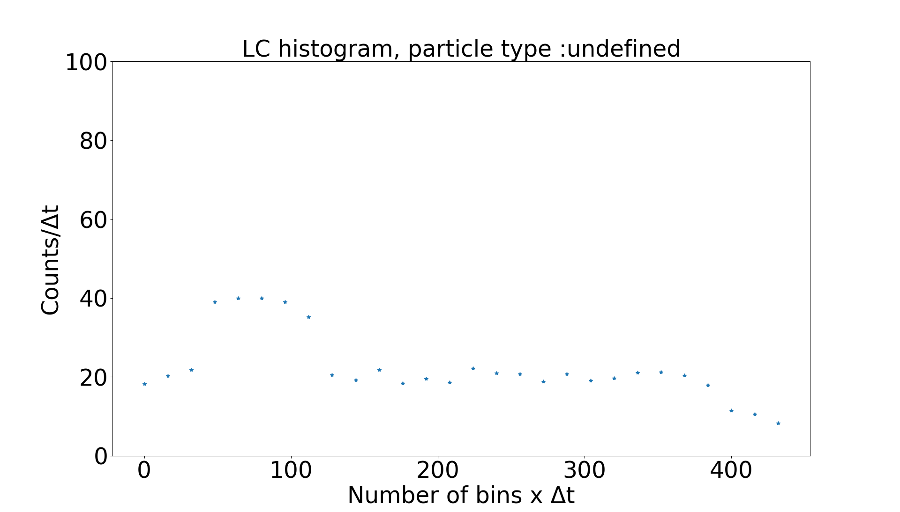
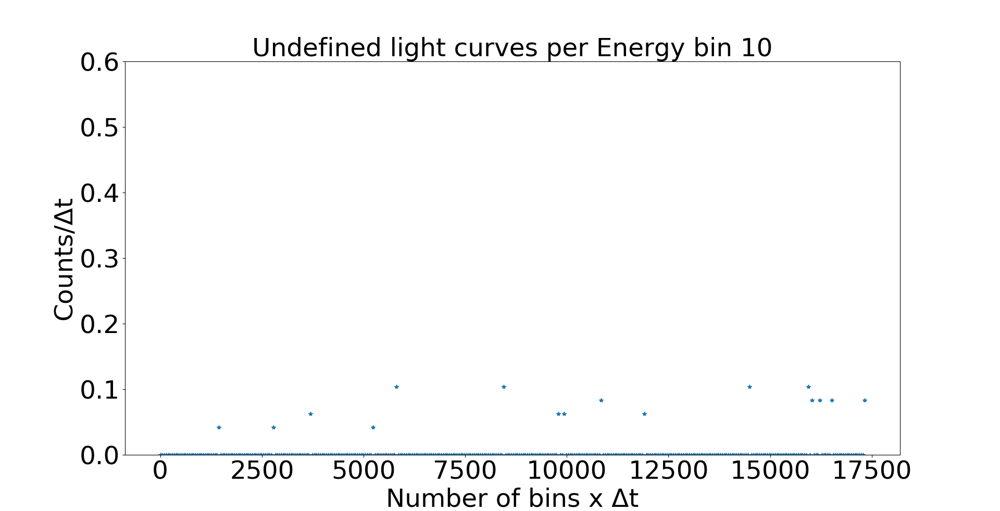

# SCI Algorithms Project

## General Description of the Program  

### What it does

This project holds the scintillator program. The program performs analysis of High Gain and Low Gain energy values of detected particles. In addition, the program constructs energy spectrum histograms and light curve plots.

The program performs analysis on the test data that can be read from either from an array or a *.txt* file. The test data contains test measurement data acquired with the scintillator module and EASIROC microcontroller using Na22 (Sodium 22 isotope) radioactive source (the source energy spectrum is represented below). The test data values can be found in */src/spectrum/array_test_data/sample.c* file.	

​																				 

### Program Output

The final output of the program are the energy spectrum histograms, the light curve graphs for each particle type and the light curve graphs for specif energies. The program outputs are depicted on the figures below.

#### Spectrum Histograms

Spectrum Histograms represent the number of particle counts as a function energy of the particles.

In the figure below we can see program output for the Na22 source test data. We know that Na22 source emits β⁺ particles, i.e. positrons, however the program detects particle type as undefined, because of the wrong pin correspondence between the EASIROC microconroller and scintillator module. 



#### Light Curves

Light Curves represent the variation of the number of counts  (of all energies) as the function of time. In the figure below you can see light curve for undefined particle type. The variation of the number of counts (figure below) is simulated using exponential distribution, for algorithm test purposes, in the *InputOutput.c* module. 

​																		 


#### Light Curves per Energy

In addition, the natural question to ask, what's it's the variation of particles counts during the acquisition time, for a specific energy. In the figure below, you can see the variation of the light curves for the undefined particle type of the energy 10. The variation of the number of counts is simulated using exponential distribution, for algorithm test purposes, in the *InputOutput.c* module.





## Content of the Program

The dependency tree of some files of the program can be visualised below.

The program is separated into three main parts:

1. The *src/InputOutput/InputOutput.c* module reads the data.
2. The *src/spectrum/spectrum.c* module performs data treatment, constructs spectrum histograms and light curves.
3. The sci_helper_scripts/sci_plot_maker.py plots the spectrum histograms and light curves. 

```shell
.
├── bin
│   └── App.bin
├── doc
│   ├── Doxyfile
|	└── HTML
├── Makefile
├── obj
├── output
│   ├── LC
│   └── SP
├── README.md
├── sci_helper_scripts
│   └── sci_plot_maker.py
└── src
    ├── InputOutput
    │   ├── InputOutput.c
    │   └── InputOutput.h
    ├── main.c
    └── spectrum
        ├── array_test_data
        │   ├── sample.c
        │   └── sample.h   
        ├── file_test_data
        ├── spectrum.c
        └── spectrum.h

```

## sci_helper_scripts

sci_helper_scripts folder contains scripts used to prepare raw source test data (input for the main program), to plot light curves and spectrum histograms

* *sci_plot_maker.py* - plots light curves and spectrum histograms

* *sci_test_data_extraction.py* - extracts data from the raw test acquisitions (for example, *StageSCI2021_MarcinKOVALEVSKIJ/IGOSat/Measured_samples*), prepares the data as the input for the main program

* *sci_generate_random_test_data.py* - generates random test input data from Gaussian and Poisson distributions

* *sci_other_functions.py* - contains other functions used during the development of this project 

   

## How to run the program

1. Download this directory onto your local machine.

2. Compile all C sources, navigate to the root of the program represented with a **.** (dot) on the tree above, then type in your shell terminal  :

```shell
make
```

3. Start the code by typing :

```shell
make run
```

​	4. Navigate to the *sci_helper_scripts* folder and type:

```shell
python3 sci_plot_maker.py
```

## How to prepare and load new sample data

To perform analysis of a new sample data (acquired with the EASIROC board), please follow the steps below:

1.  Prepare the data (EASIROC board outputs two, HG and LG, files per one acquisition) using *sci_test_data_extraction.py* script. Specify only the start_index and end_index in the *prepare_test_data()* function, as well as provide path to the folder that contains LG and HG files, for further description refer to ***sci_test_data_extraction.py*** script. Once preparation is finished, you can grab ouput .txt files (for HG and LG data) in the directory where original sample data is located. 

2. Place two .txt files in the ***src/spectrum/file_test_data*** folder.

3. Open **src/InputOutput/InputOutput.c**, in the function **INPUTOUTPUT_read_test_data_from_file()** modify ***fptr_hg*** and ***fptr_lg*** fields by changing the source file names in the ***fopen()*** function.

   **NOTE** 

   The data could be also read from arrays using ***INPUTOUTPUT_read_test_data_from_array()*** function, if you want to read the data from arrays, proceed as follows:

   1. In the *Makefile* on the line 28 remove ***-DUSE_INPUT_FILE***, so that the field on the line 28 becomes *CFLAGS = $(OPTIMIZATION) -Wall -Wextra -g3 -DSPECTRUM_binning* 
   2. In the *src/spectrum/array_test_data* open *sample.c* file copy & paste the data from the *.txt* files to the **unsigned short SAMPLE_DATAG_HG[]= {}** and **unsigned short SAMPLE_DATAG_LG[]= {}** arrays, see the example in the *sample.c* file (Tip: in order to  insert a ***comma ,*** in between the array entries use Find & Replace option in a simple .txt editor, other editors could crash, in the find field enter a space, in the replace field enter a comma).

4. In the *src/spectrum/spectrum.h* modify change ***SPECTRUMC_CEBR3_SIPM*** and ***SPECTRUMC_EJ200_SIPM*** macros (these macros are described below).

## How to change the program output

### Modifiable Parameters

#### General Parameters

General modifiable parameters are :

* ***SPECTRUM__C_ALL_ENERGY_MEASUREMENT_ARRAY_SIZE*** , changes the number of acquisitions read from a test data file, by default the macro is set to 10 000, i.e. the program performs analysis of all data available. Current data size is of 10 000 acquisitions,  setting this macro to a value > 10 000 will result in an undefined program behaviour. The macro is located in *src/spectrum/spectrum.h*.
* static unsigned int **SPECTRUM_G_PARAM_threshold_hg**, changes the high gain threshold value for one acquisition (over all 26 channels) energy sum, if the variable is less than one acquisition energy sum, then HG energy data is recorded, else LG. The variable is located in *src/spectrum/spectrum.c.*
* static unsigned int **SPECTRUM_G_PARAM_high_threshold**, changes the high threshold value for one energy channel, i.e. the energies above the value of the high_threshold variable are invalid. The variable is located in *src/spectrum/spectrum.c.*
* static unsigned int **SPECTRUM_G_PARAM_low_threshold**, changes the low threshold value for one energy channel, i.e. the energies below the value of the low_threshold variable are invalid. The variable is located in *src/spectrum/spectrum.c.*
* **SPECTRUM__C_CEBR3_SIPM** macro, defines which 16 pins among 26 pins available correspond to the CEBR3 scintillator on the EASIROC board 
* **SPECTRUM__C_EJ200_SIPM** macro, defines which 10 pins among 26 pins available correspond to the EJ200 scintillator on the EASIROC board
  * the data in src/spectrum/array_test_data/sample.c (source : Na22) was aquired with the following pin correspondance: 
    * **SPECTRUM__C_CEBR3_SIPM**  (0b00000000000000000000000000)
    * **SPECTRUM__C_EJ200_SIPM**    (0b00000000001111111111111111)
  
  * Technically, you can see from the input test data which pins correspond to the noise and which correspond to the signal. 

#### Spectrum Histograms

Spectrum modifiable parameters are :

* *static unsigned int **SPECTRUM_G_PARAM_spectrum_energy_step***, changes the number of energy bins of all particle histograms. The variable is located in src/spectrum/spectrum.c.
* **SPECTRUM_binning** macro, changes the maximum number of energy bins for the construction of spectrum histograms. The default maximum number of spectrum energy bins is 512, in order to change this value to 1024, navigate to *Makefile* line 28 CFLAGS field, then remove DSPECTRUM_binning option, so to get CFLAGS = $(OPTIMIZATION) -Wall -Wextra -g3 -DUSE_INPUT_FILE .

#### Light Curves

Light Curves modifiable parameters are :

* *static unsigned int **SPECTRUM_G_PARAM_number_of_bin_lc***, changes the number of light curve bins for all particle histograms. The variable is located in src/spectrum/spectrum.c.
* static unsigned int **SPECTRUM_G_CNST_acquisition_duration** changes the acquisition duration for all particle histograms. The variable is located in src/spectrum/spectrum.c.
* **acquisition_period[index].date** stores particle detection time, particle detection time is simulated by drawing the date from the exponential distribution i.e. *date* ~ exp(*λ*). You can modify λ (mean number of events), by modifying **double random_exponential_distribution(double lambda)** function in the ***void INPUTOUTPUT_read_test_data_from_array()*** function which is located in *src/InputOutput/InputOutput.c*. 

#### Light Curves per Energy

Light Curves per energy modifiable parameters are :

* static unsigned short **PARAM_LC_per_SP_ENERGY_values**[], array containing the energies for which the light curves will be computed.
  For an example see *spectrum.c*. 

* **SPECTRUM_PARAM_LC_per_SP_arr_size**, macro that defines the number of elements (energies) in the **PARAM_LC_per_SP_ENERGY_values** array.

  In order to modify other parameters, such as, number_of_bins or acquisition_duration, please refer to the description of the Light Curves (paragraph above). 

## Light Curves per Energy algorithm

Willing to store the information about the light curves per particle and per energy, it's necessary to store the sequence of all the acquisition data and the detection time stamps for a given particle. Therefore, storing the light curves, for each particle type, and for each energy, we would quickly run into the memory storage issues, as the required memory is on the order of a few GB.

There's a few ways that we can minimize the energy storage requirements:

1. We may not be interested in the light curves for all energies. 
2. Any given energy, during the acquisition time, occurs only at some specific times, yet it's necessary to store all the time instances, at which a given energy has occurred or not (in order to preserve the continuity of the light curve plots). Thus, given the fact that the light curve array for a given energy is mainly sparse, it's inefficient to store all the times at which a given energy has occurred or not. Instead, we can store the number of consecutive counts at which a given energy haven't occurred, which is more memory efficient (for detailed calculation and memory storage comparison, see software memory consumption sheet).

# List of bugs:

# TO DO :

- [x] Implement a possibility to output light curve per energy. ***[COMPLETED]***

  ​	Currently, the algorithm outputs one LC of the sum of all energies for a each particle. We would like to produce LC for a given energy, for example, 	how the number of particles of the energy bin 255 evolved during the acquisition time. As it's shown in the telemetry spreadsheet  (*Nextcloud/Upload2021/StageSCI2021_MarcinKOVALEVSKIJ/IGOSat/IGOSat-SAT.PL.SCI-PL-G001_1.1_PlanMissionSci.xlsx*) LC
  ​	generation for all energies would highly exceed disposable memory. The possible solution would be to output LC's only for certain energies or for 	certain range of energies.

- [x] Implement light curve per energy plots (in Python). **[COMPLETED]**

- [ ] Implement 3D plots (in Python) in (Counts, Energy, Time) space, this should be completed once light curves per energy algorithm is completed. 

- [ ] Test the algorithm with a set of values recorded using all 26 channels.

  ​	Currently, we have test data for 15 channels, in order to fully test the algorithm we need data from all 26 channels.

- [ ] Perform the program tests for :

  - various energy values

  - various time values
  - user input

- [ ] Change all time calculations from float type to integer type.

- [ ] Reduce the number of global variables, leave only those that could be used by other external modules, or are strictly necessary for the working of a given algorithm.

- [ ] Reduce the number of macro variables, leave only those that are strictly necessary, for example, predefined array sizes  

- [ ] Verify all algorithms for the errors, implement correct error handling, for example :

  - logical correctness of the algorithms
  - division by 0
  - variable overflows
  - variable type compatibility, make sure that variable type will correspond to the mission needs, e.x. many variables are defined as 2 Bytes shorts, verify if they shouldn't be defined as 4 Bytes integers

- [ ] Modify the particle determination function *SPECTRUM_source_definition()* *[To discuss with H. HALLOIN and P.LAURENT]*

  Currently, the algorithm is very simple, however, it's simplicity has a drawback:

  * The algorithm identifies the particles as undefined if the number of the necessary channels is smaller than required *(see Scintillateur_user_manual.pdf)*. However, as the tests shows, we can determine the particle energy distribution even with a single functional channel. As the consequence, we could loose valuable information regarding the particle type.   

- [ ] As described by P.LAURENT in *Nextcloud/Upload2021/StageSCI2021_MarcinKOVALEVSKIJ/Bibliographie/SCI_WelcomePackage/Datasheets/Scintillateur_user_manual.pdf*  light curve algorithms should be implemented only for electrons and photons, yet we've implemented light curve algorithms, including for undefined particles (because lack of data from at least 16 channels). Once the test data from 16-26 input channels is obtained, remove code parts that produce light curves for undefined particles (easy).

# Comments

After completing steps defined in the above TODO list, the software will be ready for the test.

